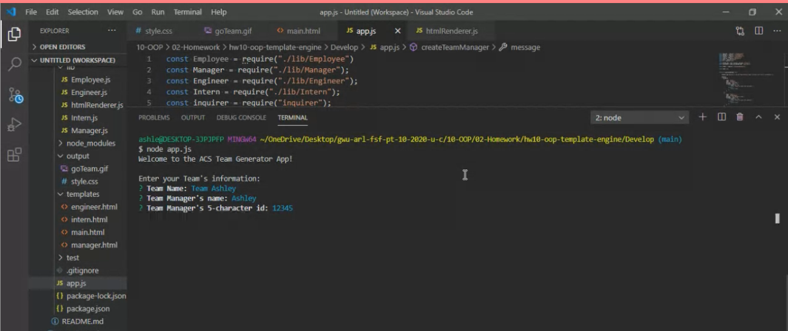

# hw10-oop-template-engine, 28 JAN 21

#### By Ashley Stith

## Description
This Application is a software engineering team generator command line application. The application prompts the user for information on the team manager and members.  The application allows the user to enter as many team members as they want. The team members may also be any combination of interns and engineers. The application dynamically generates a nicely formatted team roster in the form of an HTML file based on user input.  The [Inquirer package](https://www.npmjs.com/package/inquirer) is used to prompt the user for specific information about each of the team members.  The application is invoked by using the following command:

```bash
node app.js
```

The generated HTML file contains a card for each team member. The manager card includes the manager's name, ID, email and office number.  The engineer card includes the engineer's name, ID, email, and GitHub repo link.  The intern card includes the intern's name, ID, email, and the name of their school.

Because the application is not deployed, a video demonstrating its functionality is included.  The video was created using Screencastify and a link to it is included below. A [test team.html file](./output/team.html) has also been included to show an example of a generated HTML file.

Video demo of the application: *Note: The application may have been slightly updated since recording demo*
[](https://drive.google.com/file/d/11Y8WhR4ZUrLrsilau0UCbpgKThgsRRok/view?usp=sharing)

## Installation
* Create a `.gitignore` file and include `node_modules/` and `.DS_Store/`
* Install npm dependencies using the following command:
```bash
npm i --save
```
## Features
* The user input is run through a validation to make sure each input is in the right format.  Validation examples are shown in the demo video above.
    * managerName, internName, engineerName must all be at least one character
    * managerOfficeNumber must be 10 digits
    * managerId, internId, engineerId must all be 5 characters long
    * engingeerGithub must be at least one character
    * internSchool must be at least one character

## Known Bugs
Site has no known bugs

## Technologies Used
* node.js
* inquirer.js
* Bootstrap

## Contribution Guidelines
Direct link to repository: https://github.com/stithac/hw10-oop-template-engine


